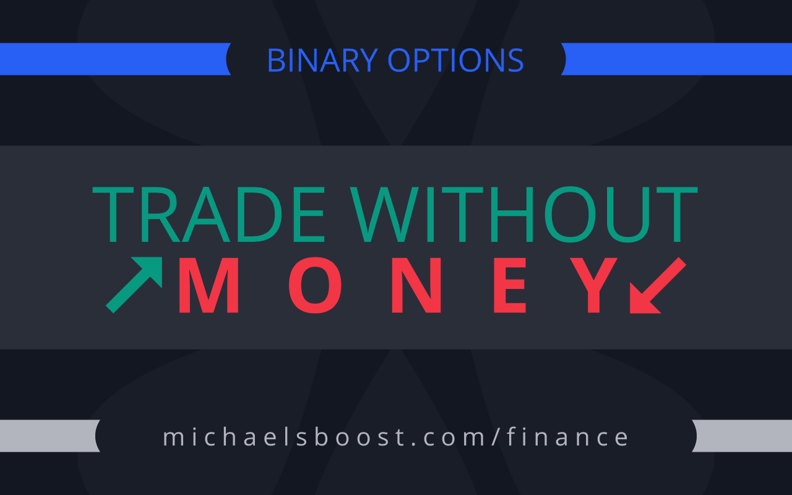

# The Trading Game 📈

A real-time trading simulator that lets you practice trading various financial instruments without risking real money. Perfect for learning trading strategies and testing your market intuition.



## Features 🚀

- **Multi-Asset Trading**: Practice trading across different markets:
  - 💹 Equity Indices (Dow Jones 30, Nasdaq 100, S&P 500)
  - 💱 Forex (EUR/USD, GBP/USD, USD/JPY, and more)
  - 🏆 Commodities (Gold, Silver, WTI Crude Oil)
  - ₿ Cryptocurrencies (Bitcoin, Ethereum, Ripple, Cardano)

- **Professional Trading Interface**:
  - Real-time price charts powered by TradingView
  - Technical indicators (ADX, MACD)
  - Customizable timeframes
  - Interactive chart tools

- **Trading Features**:
  - Adjustable trade duration (hours, minutes, seconds)
  - Customizable wager amounts
  - Real-time profit/loss tracking
  - Trade history with performance statistics

- **User Experience**:
  - Modern, responsive design
  - Dark theme for comfortable trading
  - Animated transitions
  - Mobile-friendly interface

## How to Play 🎮

1. **Select Your Market**:
   - Visit the landing page
   - Choose from various trading instruments
   - Click on your preferred market to start trading

2. **Set Your Trade Parameters**:
   - Adjust your wager amount (default: $100)
   - Set trade duration (default: 5 seconds)
   - Monitor current price movements

3. **Make Your Trade**:
   - Click "Buy" if you think the price will go up
   - Click "Sell" if you think the price will go down
   - Wait for the trade duration to complete

4. **Track Your Performance**:
   - View your trade history
   - Monitor your win rate
   - Track your balance changes

## Getting Started 🛠️

1. Clone the repository:
   ```bash
   git clone https://github.com/yourusername/TheTradingGame.git
   ```

2. Open `landing.html` in your web browser to start trading

## Technical Details 🔧

- **Frontend Technologies**:
  - HTML5
  - CSS3 (Tailwind CSS)
  - JavaScript (Vanilla)
  - TradingView Charting Library

- **Features**:
  - Local storage for saving game state
  - Real-time price updates
  - Responsive design with Tailwind CSS
  - AOS (Animate On Scroll) for smooth animations

## Contributing 🤝

Contributions are welcome! Please feel free to submit a Pull Request.

## License 📝

This project is licensed under the MIT License - see the [LICENSE](LICENSE) file for details.

## Acknowledgments 👏

- TradingView for their excellent charting library
- Alpha Vantage for market data
- Icons and design inspiration from various open-source projects

## Disclaimer ⚠️

This is a simulation game for educational purposes only. No real money is involved. Trading financial instruments carries significant risks, and you should never trade with money you cannot afford to lose.
